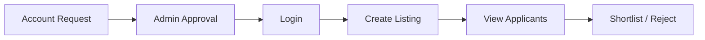

# Online-Internship-Placement-Preparation-Portal

| **Vyshali Aytha**    |
| **Vismaya Harish**   | 
| **Thejus A Reddy**   | 
| **Yashas Sadananda** |

A web-based platform designed to support students in their internship and placement preparation while providing recruiters and the placement cell with tools to manage opportunities, applications and placement activities.

This project is developed as a Software Engineering Mini Project covering requirements specification, software architecture and design, UML modelling, testing and requirements traceability.

---

##  Project Overview

The Online Internship & Placement Preparation Portal provides a centralized platform for students to prepare for internships and placements and manage their applications.

The system supports three primary user roles:

- **Student**
- **Recruiter**
- **Placement Cell Admin**

### Student

Students can:

- Register using OTP verification
- Log in securely
- Create and update their profile
- Upload and replace resumes
- Generate PDF resumes
- Browse internship and placement listings
- Filter listings
- Apply for opportunities
- Track application status
- Take timed mock tests
- View score history
- Access interview preparation resources
- Book mock-interview slots

### Recruiter

Recruiters can:

- Request an account
- Log in after administrative approval
- Create internship/placement listings
- View applicants
- Shortlist or reject applicants

### Placement Cell Admin

The Placement Cell Admin can:

- Approve or reject recruiter accounts
- Manage mock-interview slots and feedback
- Generate placement summary reports

---

##  Objectives

The main objectives of the project are:

- Provide students with a centralized internship and placement preparation platform.
- Simplify the process of discovering and applying for internship and placement opportunities.
- Provide mock assessments and interview preparation resources.
- Enable recruiters to post opportunities and manage applicants.
- Allow the Placement Cell to manage recruiter access and placement reporting.
- Apply software engineering practices such as modular architecture, security, testing, and requirements traceability.

---

##  Architecture

The system follows a **Layered Architecture** consisting of three layers:

| Layer | Components | Responsibility |
|---|---|---|
| **Presentation Layer** | Web UI | Provides the user interface for Students, Recruiters, and Placement Cell Admins |
| **Business Layer** | AuthModule, ProfileModule, ListingModule, ApplicationModule, AssessmentModule, InterviewPrepModule, RecruiterModule, AdminModule | Handles the core business logic and system functionality |
| **Data Layer** | Relational Database | Stores and manages persistent application data |

### Architecture Flow

**Presentation Layer**  
Web UI  
↓  
**Business Layer**  
AuthModule · ProfileModule · ListingModule · ApplicationModule · AssessmentModule · InterviewPrepModule · RecruiterModule · AdminModule  
↓  
**Data Layer**  
Relational Database

The architecture separates the **user interface**, **business functionality**, and **persistent data storage**.

### Main Modules

| Module | Responsibility |
|---|---|
| **AuthModule** | Registration with OTP, login, JWT sessions, account lockout, and recruiter account requests |
| **ProfileModule** | Student profile and resume management |
| **ListingModule** | Internship/placement listings and filtering |
| **ApplicationModule** | Application submission, duplicate prevention, and application tracking |
| **AssessmentModule** | Timed mock tests, automatic scoring, and score history |
| **InterviewPrepModule** | Interview question bank, mock-interview booking, and feedback |
| **RecruiterModule** | Listing creation and applicant viewing/shortlisting |
| **AdminModule** | Recruiter approval and placement reporting |

##  Technology

The architecture and design documentation currently specifies a **technology-agnostic implementation approach**.

| Category | Planned Technology |
|---|---|
| **Frontend** | Responsive Web Frontend |
| **Backend API** | REST/JSON API |
| **Backend Framework** | Node.js/Express or Spring Boot |
| **Database** | PostgreSQL or MySQL |
| **Authentication** | JWT |
| **Communication Security** | HTTPS/TLS |
| **OTP Delivery** | Email/SMS Gateway |

> The final implementation technology will be selected during development.

---

##  Main Workflows

###  Student Application

###  Recruiter Workflow

###  Placement Preparation

---
